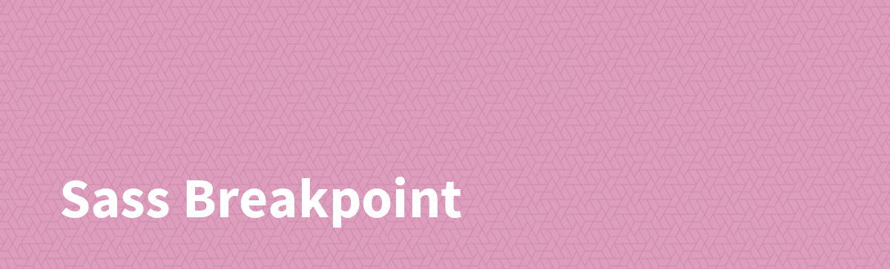

# Sass Breakpoint



[](https://www.npmjs.com/package/@sass-collective/sass-breakpoint)
[](https://www.npmjs.com/package/@sass-collective/sass-breakpoint)
[](https://www.npmjs.com/package/@sass-collective/sass-breakpoint)

## Introduction

Generate CSS breakpoint.

## Install

    npm install @sass-collective/sass-breakpoint --save

## Usage

### Mixin

```scss
breakpoint($min-width, $max-width, $root-selector);
```

### Variables

| Names              | Values    | Descriptions                                                         |
| ------------------ | --------- | -------------------------------------------------------------------- |
| ``$strict``        | true      | Subtract ``1px`` on ``max-width`` value, ``960px`` come ``959px``    |
| ``$very-small``    | 320       | iPhone in portrait mode                                              |
| ``$small``         | 480       | iPhone in landscape mode                                             |
| ``$medium``        | 768       | iPad in portrait mode                                                |
| ``$large``         | 960       | Desktop                                                              |
| ``$wide``          | 1200      | Wide screen                                                          |

### Update default variables in global

```scss
@use "@sass-collective/sass-breakpoint" with (
    $large: 960
);
```

### Module System

```scss
@use "@sass-collective/sass-breakpoint";

// Mixin

body {
    // Min width
    @include sass-breakpoint.breakpoint(960) {
        font-size: 10px;
    }

    // Max width
    @include sass-breakpoint.breakpoint($max-width: 960) {
        font-size: 10px;
    }

    // Between
    @include sass-breakpoint.breakpoint(480, 960) {
        font-size: 10px;
    }

    // Parent class or ID
    @include sass-breakpoint.breakpoint(480, $root-selector: '.class') {
        font-size: 10px;
    }
}
```

### Legacy @import

```scss
@import "@sass-collective/sass-breakpoint";

// Mixin

body {
    // Min width
    @include sass-breakpoint(960) {
        font-size: 10px;
    }

    // Max width
    @include sass-breakpoint($max-width: 960) {
        font-size: 10px;
    }

    // Between
    @include sass-breakpoint(480, 960) {
        font-size: 10px;
    }

    // Parent class or ID
    @include sass-breakpoint(480, $root-selector: '.class') {
        font-size: 10px;
    }
}
```

### CSS

```css
/* Min width */
@media all and (min-width: 960px) {
    body {
        font-size: 10px;
    }
}

/* Max width */
@media all and (max-width: 959px) {
    body {
        font-size: 10px;
    }
}

/* Between */
@media all and (min-width: 480px) and (max-width: 959px) {
    body {
        font-size: 10px;
    }
}

/* Parent class or ID */
@media all and (min-width: 480px) {
    .class body {
        font-size: 10px;
    }
}
```
